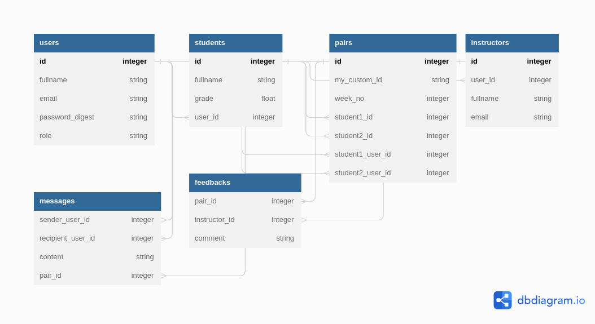

# SERVER SIDE

## Entity Relationship Diagram

## Client side Github repository

- [Client side Github repository](https://github.com/lihavi/Moringa-pairing-project)

## Overview
This is the backend of a web application that pairs students together for collaboration. The app allows instructors to view and manage the pairings, as well as communicate with students through a messaging system.

## API Endpoints
The backend provides the following API endpoints:

- GET /students: Returns a list of all students in the system.
- POST /students: Creates a new student with the given data.
- GET /students/:id: Returns the student with the given ID.
- PUT /students/:id: Updates the student with the given ID with the given data.
- DELETE /students/:id: Deletes the student with the given ID.
- GET /pairs: Returns a list of all pairings in the system.
- POST /pairs: Creates a new pairing with the given data.
- GET /pairs/:id: Returns the pairing with the given ID.
- PUT /pairs/:id: Updates the pairing with the given ID with the given data.
- DELETE /pairs/:id: Deletes the pairing with the given ID.
- GET /instructors: Returns a list of all instructors in the system.
- POST /instructors: Creates a new instructor with the given data.
- GET /instructors/:id: Returns the instructor with the given ID.
- PUT /instructors/:id: Updates the instructor with the given ID with the given data.
- DELETE /instructors/:id: Deletes the instructor with the given ID.
- GET /messages: Returns a list of all messages in the system.
- POST /messages: Creates a new message with the given data.
- GET /messages/:id: Returns the message with the given ID.
- PUT /messages/:id: Updates the message with the given ID with the given data.
- DELETE /messages/:id: Deletes the message with the given ID.

## Security
The app implements basic authentication and authorization, with passwords being stored as hashes in the database. Instructors can only access and modify data related to their own account, while students can only access data related to their own pairing.

## Deployment
The backend is deployed on a cloud platform and is accessible through a publicly available API.

Backend link-https://moringa-pair-ikt7.onrender.com

## Conclusion
This backend provides a solid foundation for a pairing app that can be extended with additional features as needed.